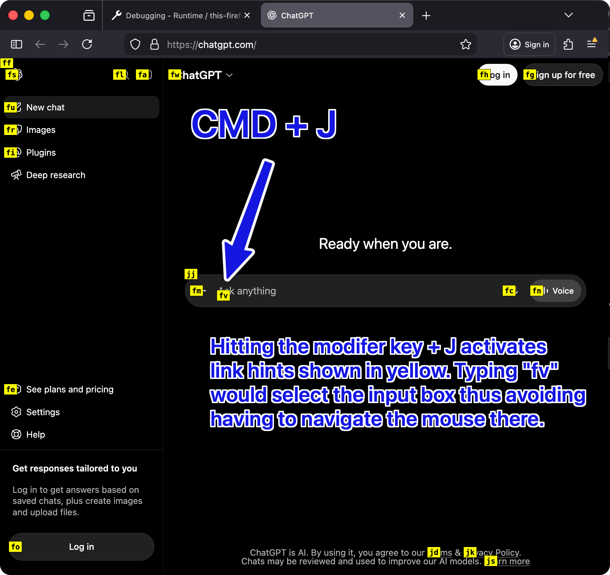

# Tiny Link Hints

Tiny Link Hints is a tiny browser extension for keyboard-driven link and control navigation.

Press a modifier key plus `J`, `K`, or `L` to label visible page targets, type the displayed hint, and the extension activates the matching element.

## Shortcuts

The default modifier is `Command` on macOS.

| Shortcut | Action |
| --- | --- |
| Modifier + `J` | Click or focus the selected link, button, input, textarea, select, or text box |
| Modifier + `K` | Open the selected link in a background tab |
| Modifier + `L` | Open the selected link in a foreground tab |
| `Escape` | Clear visible hints |
| `Backspace` | Delete the last typed hint character |

The modifier key can be changed from the extension options page.

## Install Locally

### Firefox

1. Open `about:debugging#/runtime/this-firefox`.
2. Click **Load Temporary Add-on**.
3. Select `manifest.json` from this repository.

### Chrome, Edge, Brave, and Other Chromium Browsers

Chromium browsers require the Manifest V3 file to be named `manifest.json`.

1. Copy `manifest.chrome.json` to `manifest.json`.
2. Open `chrome://extensions`.
3. Enable **Developer mode**.
4. Click **Load unpacked**.
5. Select this repository directory.

If you switch back to Firefox development, restore the Firefox Manifest V2 `manifest.json`.

## Project Layout

| File | Purpose |
| --- | --- |
| `hints.js` | Content script that finds visible targets, renders hint labels, tracks typed hint text, and activates matches |
| `background.js` | Opens selected links in new tabs for `K` and `L` actions |
| `options.html` | Minimal options page shell |
| `options.js` | Renders and saves the modifier-key preference |
| `manifest.json` | Firefox/WebExtension Manifest V2 manifest |
| `manifest.chrome.json` | Chromium Manifest V3 manifest |
| `SECURITY_REVIEW.md` | Line-by-line security review of the extension |

## Permissions

Tiny Link Hints uses a small permission set:

| Permission | Why it is needed |
| --- | --- |
| `storage` | Saves the selected modifier key locally |
| `tabs` | Opens the user-selected link in a new tab in Firefox Manifest V2 |
| `<all_urls>` content script match | Lets the hint script run on pages where you want keyboard navigation |

The extension has no dependencies, build step, analytics, telemetry, remote code, or network requests.
